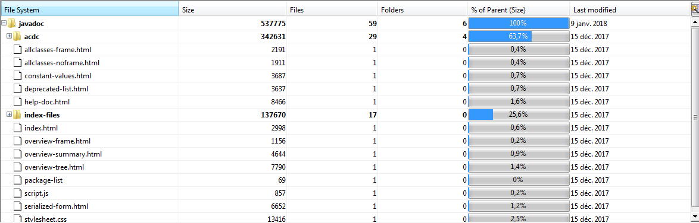
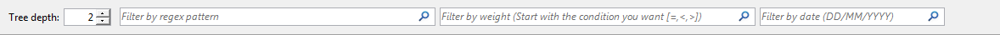
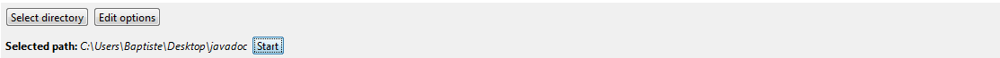
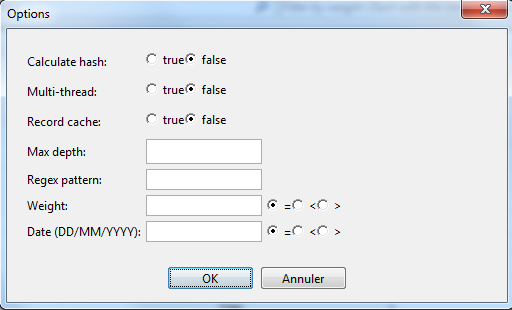
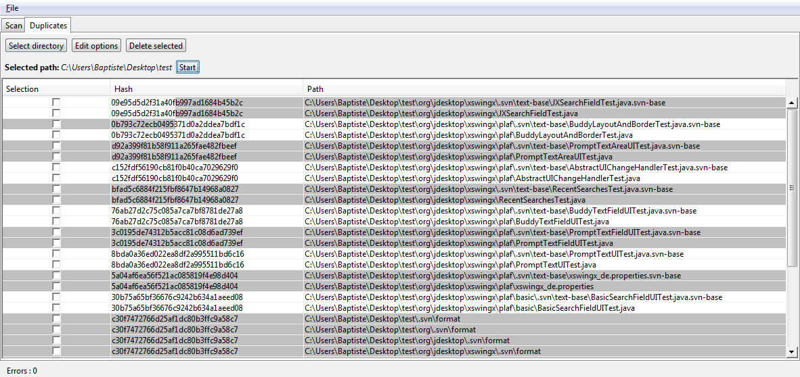
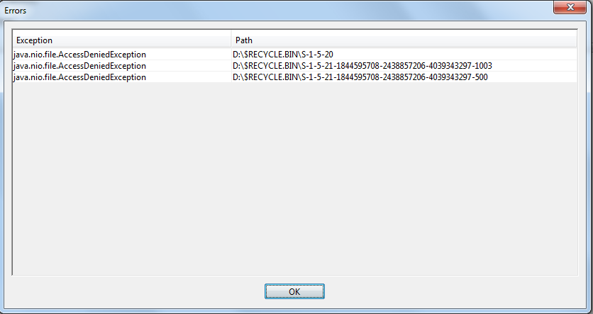

# Compte-rendu Partie Front-end

Baptiste Vrignaud

## 1 - Utilisation du jar

Double-cliquez sur le jar Projet_ACDC_IMFDLP-1 disponible dans le dossier /app
        
## 2 - Organisation du projet

J'ai organisé mon IHM en panel avec deux onglets : un pour le scan et montrer l'arbre, l'autre pour montrer les doublons.

### 2.1 - TreePanel

.

Cette partie est composé d'un composant Outline de Netbeans pour afficher un TreeModel dans un tableau.
Je me suis inspiré de TreeSize pour les colonnes, notamment le pourcentage de taille en fonction du parent.
Un clic-droit sur un répertoire affiche un menu qui permet d'afficher les doublons du dossier. Ce bouton mène vers le DuplicatesPanel et affiche les doublons.

### 2.1 - FilterPanel

.

Ce panel permet de n'afficher que les lignes du tableau correspondantes aux différents champs de filtrage.
J'utilise le QuickFilter du composant Outline de Netbeans. J'ai juste du implémenter QuickFilter dans le filtre de Valentin et surcharger une méthode accept qui prend un objet en paramètre.
Un JSlider permet de expand/collapse à la demande les noeuds de l'arbre pour afficher une profondeur de plus.
J'ai mis ce système car le filtre ne s'applique qu'aux lignes visibles du tableau. Je laisse donc l'utilisateur choisir sa profondeur.
Au début, à chaque fois qu'un filtre était mis à jour, je déroulais tout l'arbre. Mais pour les arborescences importantes, cela bloquait l'UI longtemps.
Le champ Regex permet de filtrer le nom des fichiers (exemple: "jpg|png" pour les fichiers .jpg et .png).
Le champ Weight permet de filtrer par rapport au poids. L'utilisateur doit ajouter la condition qu'il veut au début (=,<,>).
Le champ Date doit aussi avoir comme suffixe la condition voulue.
J'utilise le pattern Observateur pour communiquer entre ce panel et le treePanel.

### 2.2 - ActionsPanel

.

Ce panel permet d'afficher les boutons d'actions de l'application. Il est utilisé dans le TreePanel et dans le DuplicatesPanel.
La seule différence est le bouton "Delete duplicates" pour supprimer les doublons sélectionné dans DuplicatesPanel.
Ce composant utilise aussi le pattern Observateur pour communiquer avec les autres composants et utilise un FileChooser à l'appui sur "Select Directory".
Ce qui va changer le selectedPath. L'utilisateur pourra ensuite éditer ses options (voir panel suivant) et lancer le scan.

### 2.3 - OptionsPanel

.

Ce panel permet d'afficher les différentes options avant le lancement d'un scan. On peut activer la mise en cache, le multi-thread, le calcul des hashs,
la profondeur maximale voulue. On peut aussi appliquer un filtre à la construction.
Ce composant est utilisé dans TreePanel et dans DuplicatesPanel. Dans DuplicatesPanel, il a juste les options de filtrage.

### 2.4 - DuplicatesPanel

.

Ce panel affiche les doublons dans un JTable. On peut en sélectionner et les supprimer. Les différents fichiers sont séparés par deux couleurs.

### 2.5 - ErrorPanel

.

Ce panel affiche les erreurs parvenus pendant l'exécution du parcours du système de fichiers. Il est accessible via un bouton en bas de l'interface.

## 3 - Difficultés rencontrés

* **Composant avec un JTree et un JTable**

J'ai testé pleins de solutions disponible sur le net sans succès (JTreeTable, swingx) jusqu'à ce que je tombe par hasard sur le composant Outline
qui faisait tous ce dont j'avais besoin facilement. J'ai juste eu à fournir un treemodel et un fichier spécifiant les colonnes voulues.

## 4 - Points positifs

L'interface est claire et permet de voir quels fichiers prennent le plus de place. On peut filtrer les fichiers .avi dans un ordre anté-chronologique.

## 5 - Points négatifs

Je n'ai pas eu le temps d'implémenter de la persistence de données pour les paramètres. Ni d'implémenter une barre de progression pendant la construction de l'arbre
ou la recherche des doublons. J'aurais aussi voulu mettre à jour directement mon arbre à la construction. Mais on y a pas vraiment pensé dans la partie Back-end.